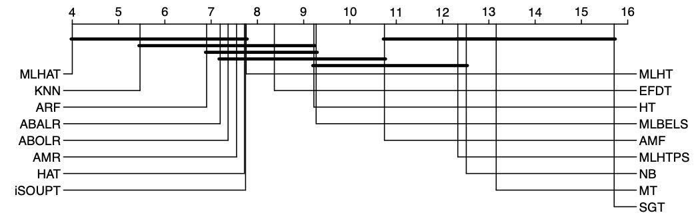

# Experimental results

This folder organizes all the materials generated during the experimentation presented in the article following the prequential evaluation framework.

The [per_datatet](per_dataset/)  subfolder breaks down the result obtained by each algorithm in each dataset. Thus, there is a CSV file for each of the evaluated metrics with the following names:
* `subset_acc.csv`: Subset accuracy as  $\frac{1}{n}\sum^n_{i=0} 1 | Y_i = Z_i$
* `hamming.csv`: Hamming loss as $\frac{1}{n L} \sum^n_{i=0} \sum^L_{l=0} 1 | y_{il} \neq z_{il}$
* `example_prec.csv`: Example-based precision as $\frac{1}{n} \sum^n_{i=0} \frac{|Y_i \cup Z_i|}{|Z_i|}$
* `example_rec.csv`: Example-based recall as $\frac{1}{n} \sum^n_{i=0} \frac{|Y_i \cup Z_i|}{|Y_i|}$
* `example_f1.csv`: Example-based F1 as $\frac{1}{n} \sum^n_{i=0} \frac{2 |Y_i \cup Z_i|}{|Y_i| + |Z_i|}$
* `micro_prec.csv`: Micro-averaged precision as $\frac{\sum^L_{l=0} tp_l}{\sum^L_{l=0} tp_l + \sum^L_{l=0} fp_l}$
* `micro_rec.csv`: Micro-averaged recall as $\frac{\sum^L_{l=0} tp_l}{\sum^L_{l=0} tp_l + \sum^L_{l=0} fn_l}$
* `micro_f1.csv`: Micro-averaged F1 as the harmonic mean of the precision and recall in an equivalent way to the example-based F1 defined above.
* `macro_prec.csv`: Macro-averaged precision as $\frac{1}{L} \sum^L_{l=0} \frac{tp_l}{tp_l + fp_l}$
* `macro_rec.csv`: Macro-averaged recall as $\frac{1}{L} \sum^L_{l=0} \frac{tp_l}{tp_l + fn_l}$
* `macro_f1.csv`: Macro-averaged F1 as the harmonic mean of the precision and recall in an equivalent way to the example-based F1 defined above.


The rows show the datasets included in the experimentation and the columns show the algorithms. The intersection is the result for the given metric following the prequential evaluation scheme. For example, for the micro-averaged F1 score the following results are obtained:

| **Dataset**      | **kNN**        | **NB**         | **AMR**        | **HT**         | **HAT**        | **EFDT**       | **SGT** | **MT** | **ARF**        | **AMF**        | **ABA**        | **ABO**        | **MLHT**       | **MLHTPS** | **iSOUPT**     | **MLHAT**      |
|:-----------------|:---------------:|:---------------:|:---------------:|---------------:|:---------------:|:---------------:|:--------:|:-------:|:---------------:|:---------------:|:---------------:|:---------------:|:---------------:|:-----------:|:---------------:|:---------------:|
| **Flags**        | 0.642          | 0.642          | 0.575          | **0.710**   | 0.695          | **0.710** | 0.650   | 0.622  | 0.703          | 0.641          | 0.587          | 0.581          | 0.617          | 0.630      | 0.575          | 0.642          |
| **WaterQuality** | **0.561** | 0.549          | 0.552          | 0.420          | 0.436          | 0.459          | 0.352   | 0.357  | 0.533          | 0.509          | 0.549          | 0.553          | 0.258          | 0.382      | 0.547          | 0.553          |
| **Emotions**     | 0.484          | **0.629** | 0.319          | 0.573          | 0.575          | 0.546          | 0.389   | 0.033  | 0.547          | 0.413          | 0.300          | 0.309          | 0.342          | 0.537      | 0.319          | 0.431          |
| **VirusGO**      | 0.708          | 0.120          | 0.613          | 0.266          | 0.533          | 0.265          | 0.344   | 0.516  | 0.425          | **0.849** | 0.601          | 0.618          | 0.344          | 0.228      | 0.603          | 0.653          |
| **Birds**        | 0.164          | 0.000          | **0.176** | 0.000          | 0.000          | 0.122          | 0.081   | 0.065  | 0.115          | 0.108          | 0.174          | 0.154          | 0.000          | 0.000      | 0.175          | 0.141          |
| **Yeast**        | 0.590          | 0.545          | 0.488          | **0.599** | 0.597          | 0.589          | 0.452   | 0.477  | 0.574          | 0.485          | 0.486          | 0.489          | 0.536          | 0.583      | 0.503          | 0.595          |
| **Scene**        | 0.803          | 0.579          | 0.908          | 0.502          | 0.591          | 0.715          | 0.269   | 0.651  | 0.817          | 0.845          | 0.905          | 0.904          | 0.187          | 0.604      | 0.879          | **0.936** |
| **Gnegative**    | 0.730          | 0.639          | 0.943          | 0.656          | 0.663          | 0.670          | 0.190   | 0.737  | 0.763          | 0.879          | 0.942          | 0.941          | 0.389          | 0.640      | 0.945          | **0.952** |
| **Plant**        | 0.319          | 0.309          | **0.875** | 0.291          | 0.305          | 0.364          | 0.127   | 0.459  | 0.489          | 0.678          | 0.859          | 0.856          | 0.282          | 0.221      | **0.875** | 0.816          |
| **Human**        | 0.596          | 0.296          | **0.873** | 0.416          | 0.515          | 0.466          | 0.165   | 0.320  | 0.709          | 0.570          | 0.870          | 0.872          | 0.302          | 0.256      | 0.849          | 0.857          |
| **Yelp**         | 0.653          | 0.485          | 0.755          | 0.614          | 0.663          | 0.701          | 0.458   | 0.480  | 0.797          | 0.669          | 0.784          | 0.785          | 0.512          | 0.587      | 0.773          | **0.830** |
| **Medical**      | 0.502          | 0.003          | 0.315          | 0.520          | 0.534          | 0.636          | 0.087   | 0.287  | 0.217          | 0.574          | 0.215          | 0.200          | 0.240          | 0.003      | 0.324          | **0.654** |
| **Eukaryote**    | 0.731          | 0.239          | 0.891          | 0.544          | 0.685          | 0.646          | 0.073   | 0.486  | 0.811          | 0.655          | **0.898** | 0.897          | 0.270          | 0.242      | 0.876          | 0.893          |
| **Slashdot**     | 0.156          | 0.000          | 0.030          | 0.106          | 0.172          | 0.244          | 0.064   | 0.012  | 0.140          | 0.260          | 0.013          | 0.010          | 0.142          | 0.009      | 0.074          | **0.422** |
| **Enron**        | 0.374          | 0.436          | 0.499          | 0.429          | 0.431          | 0.442          | 0.129   | 0.303  | 0.448          | 0.451          | 0.510          | **0.511** | 0.297          | 0.276      | 0.500          | 0.481          |
| **Hypercube**    | 0.994          | 0.963          | 0.982          | 0.917          | 0.962          | 0.931          | 0.028   | 0.995  | 0.993          | **0.995** | 0.988          | 0.989          | 0.785          | 0.806      | 0.933          | 0.993          |
| **Langlog**      | 0.074          | 0.000          | 0.054          | 0.000          | 0.000          | 0.099          | 0.015   | 0.011  | 0.003          | 0.012          | 0.035          | 0.036          | 0.002          | 0.048      | 0.061          | **0.121** |
| **Stackex**      | 0.127          | 0.001          | 0.111          | 0.011          | 0.025          | 0.162          | 0.018   | 0.021  | 0.043          | 0.050          | 0.129          | 0.129          | 0.146          | 0.000      | 0.133          | **0.259** |
| **Tmc**          | 0.487          | 0.322          | 0.618          | 0.529          | 0.525          | 0.463          | 0.325   | 0.424  | 0.516          | 0.503          | 0.629          | 0.621          | 0.197          | 0.439      | 0.607          | **0.638** |
| **Ohsumed**      | 0.065          | 0.301          | 0.196          | 0.359          | 0.385          | 0.325          | 0.186   | 0.026  | 0.147          | 0.006          | 0.257          | 0.247          | 0.137          | 0.308      | 0.229          | **0.451** |
| **D20ng**        | 0.146          | 0.001          | 0.147          | 0.449          | 0.425          | 0.471          | 0.191   | 0.121  | 0.190          | 0.121          | 0.338          | 0.306          | 0.083          | 0.289      | 0.273          | **0.590** |
| **Mediamill**    | 0.600          | 0.170          | 0.553          | 0.511          | 0.519          | 0.518          | 0.223   | 0.454  | 0.583          | 0.519          | 0.558          | 0.557          | 0.425          | 0.367      | 0.521          | **0.659** |
| **Corel5k**      | 0.138          | 0.018          | 0.025          | 0.078          | 0.141          | 0.134          | 0.010   | 0.153  | **0.316** | 0.221          | 0.020          | 0.022          | 0.043          | 0.019      | 0.021          | 0.310          |
| **Bibtex**       | 0.030          | 0.000          | 0.203          | 0.216          | 0.224          | 0.218          | 0.091   | 0.111  | 0.154          | 0.141          | 0.182          | 0.183          | 0.041          | 0.090      | 0.196          | **0.353** |
| **Nuswidec**     | 0.394          | 0.331          | 0.088          | 0.236          | 0.282          | 0.243          | –       | 0.017  | 0.261          | –              | 0.075          | 0.075          | 0.011          | 0.214      | 0.121          | **0.422** |
| **Imdb**         | 0.169          | 0.187          | 0.025          | 0.047          | 0.054          | 0.085          | 0.006   | –      | 0.033          | –              | 0.054          | 0.058          | **0.242** | 0.013      | 0.038          | 0.228          |
| **Nuswideb**     | 0.373          | 0.105          | 0.111          | 0.175          | 0.275          | 0.250          | –       | –      | 0.278          | –              | 0.110          | 0.107          | 0.010          | 0.109      | 0.119          | **0.435** |
| **YahooSociety** | 0.232          | 0.349          | 0.394          | 0.243          | 0.290          | 0.250          | –       | 0.108  | 0.248          | –              | **0.451** | 0.435          | 0.369          | 0.028      | 0.420          | 0.429          |
| **Eurlex**       | 0.283          | 0.123          | 0.478          | 0.405          | 0.406          | 0.262          | 0.037   | 0.122  | 0.376          | –              | **0.600** | 0.579          | 0.074          | 0.021      | 0.546          | 0.554          |
| **SynTreeSud**   | 0.274          | 0.063          | 0.160          | 0.062          | 0.148          | 0.206          | 0.007   | 0.001  | 0.195          | 0.004          | 0.168          | 0.168          | **0.329** | 0.001      | 0.127          | 0.301          |
| **SynRBFSud**    | 0.251          | 0.209          | 0.222          | 0.294          | 0.351          | 0.257          | 0.008   | 0.040  | **0.368** | 0.166          | 0.041          | 0.040          | 0.107          | 0.085      | 0.190          | 0.269          |
| **SynHPSud**     | 0.339          | 0.011          | 0.293          | 0.111          | 0.290          | 0.275          | 0.009   | 0.000  | 0.291          | 0.001          | 0.292          | 0.293          | 0.295          | 0.000      | 0.250          | **0.362** |
| **SynTreeGrad**  | 0.297          | 0.130          | 0.138          | 0.067          | 0.103          | 0.180          | 0.010   | 0.000  | 0.192          | 0.052          | 0.165          | 0.171          | **0.348** | 0.000      | 0.109          | 0.329          |
| **SynRBFGrad**   | 0.180          | 0.196          | 0.171          | 0.246          | 0.271          | 0.207          | 0.008   | 0.010  | **0.285** | 0.083          | 0.013          | 0.013          | 0.103          | 0.068      | 0.131          | 0.201          |
| **SynHPGrad**    | 0.279          | 0.058          | 0.183          | 0.089          | 0.162          | 0.211          | 0.007   | 0.000  | 0.185          | 0.011          | 0.166          | 0.165          | 0.282          | 0.001      | 0.122          | **0.324** |
| **SynTreeInc**   | 0.270          | 0.190          | 0.143          | 0.086          | 0.139          | 0.182          | 0.010   | 0.001  | 0.173          | 0.005          | 0.164          | 0.165          | **0.316** | 0.000      | 0.105          | 0.312          |
| **SynRBFInc**    | 0.522          | 0.451          | 0.411          | 0.536          | 0.539          | 0.478          | 0.252   | 0.268  | 0.650          | **0.672** | 0.322          | 0.307          | 0.250          | 0.338      | 0.430          | 0.479          |
| **SynHPInc**     | 0.189          | 0.047          | 0.030          | 0.046          | 0.046          | 0.106          | 0.007   | 0.000  | 0.033          | 0.000          | 0.027          | 0.028          | **0.291** | 0.000      | 0.036          | 0.252          |
| **SynTreeRec**   | 0.389          | 0.214          | 0.407          | 0.283          | 0.402          | 0.368          | 0.007   | 0.108  | 0.383          | 0.108          | **0.410** | 0.409          | 0.334          | 0.000      | 0.372          | 0.390          |
| **SynRBFRec**    | 0.193          | 0.216          | 0.243          | 0.352          | **0.374** | 0.232          | 0.029   | 0.035  | 0.308          | 0.143          | 0.017          | 0.016          | 0.126          | 0.135      | 0.294          | 0.224          |
| **SynHPRec**     | 0.383          | 0.299          | 0.317          | 0.316          | 0.335          | 0.353          | 0.205   | 0.291  | 0.341          | 0.274          | 0.315          | 0.314          | 0.385          | 0.273      | 0.287          | **0.466** |
||
| *Average*      | 0.383          | 0.254          | 0.378          | 0.325          | 0.367          | 0.367          | 0.145   | 0.228  | 0.381          | 0.352          | 0.371          | 0.369          | 0.255          | 0.216      | 0.378          | **0.493** |
| *Ranking*      | 6.171          | 10.707         | 6.915          | 8.598          | 6.951          | 6.451          | 13.756  | 12.439 | 6.366          | 9.902          | 7.317          | 7.341          | 10.122         | 12.732     | 7.476          | **2.756** |


From these data, the distribution of average results per dataset for the subset accuracy, example-based F1, micro-averaged F1, and macro-averaged F1 metrics is obtained below. In these results it can be seen how MLHAT is better than the mean in 36 of the 41 datasets, with 30 in the first quartile.


## Statistical tests

The raw measures per algorithm and dataset have been used to find statistically significant differences between the studied methods. Specifically we use the Friedman test of the ranks of the metrics and the post-hoc Bonferroni-Dumm test to find the pair of groups which are significantly different.

We have use R and its [scmamp](https://github.com/b0rxa/scmamp) library in the following way:
```R
library(scmamp)

# Load raw data
rd <- read.csv(csv_path)
nAlgorithms <- ncol(rd)-1
nDatasets <- nrow(rd)
rdm <- rd[, 2: (nAlgorithms+1)]
# Friedman test. Multiple comparison
alpha <- 0.01
friedman <- friedmanTest(data=rdm,alpha=alpha)
if(friedman$p.value < alpha) {
    # Post-Hoc test
    test <- postHocTest(data=rdm, test='friedman', correct='bonferroni', alpha=alpha, use.rank=FALSE, sum.fun=mean)
}
```

For each studied metric, the ranks, Friedman's $\chi^{2}$, and the *p*-value are the following:

| **Algorithm** | **Su.Acc** | **H.Loss** | **Ex.Pre** | **Ex.Rec** | **Ex.F1** | **Mi.Prec** | **Mi.Rec** | **Mi.F1** | **Ma.Prec** | **Ma.Rec** | **Ma.F1** | **Time (s)** |
|---|---:|---:|---:|---:|---:|---:|---:|---:|---:|---:|---:|---:|
| **kNN** | 5.244 | 9.244 | 9.146 | 6.732 | 6.220 | 9.512 | 6.683 | 6.171 | 6.976 | 6.415 | 5.683 | 13.000 |
| **NB** | 11.854 | 12.061 | 11.671 | 8.427 | 9.963 | 12.366 | 8.110 | 10.707 | 12.293 | 8.378 | 10.024 | 3.098 |
| **AMR** | 7.354 | 6.085 | 7.085 | 7.524 | 7.183 | 5.280 | 7.500 | 6.915 | 5.915 | 7.549 | 7.085 | 8.171 |
| **HT** | 8.756 | 7.598 | 8.793 | 8.976 | 8.671 | 8.573 | 9.000 | 8.598 | 9.244 | 9.024 | 8.732 | 7.220 |
| **HAT** | 7.354 | 7.378 | 8.268 | 7.463 | 7.098 | 8.293 | 7.488 | 6.951 | 8.146 | 7.488 | 7.220 | 8.488 |
| **EFDT** | 7.854 | 9.817 | 8.866 | 6.585 | 6.476 | 9.744 | 6.634 | 6.451 | 8.732 | 6.537 | 5.780 | 10.561 |
| **SGT** | 14.780 | 13.780 | 10.976 | 11.244 | 13.610 | 14.756 | 11.122 | 13.756 | 14.073 | 10.146 | 11.878 | 15.024 |
| **MT** | 12.317 | 8.854 | 8.683 | 13.049 | 12.805 | 8.951 | 13.122 | 12.439 | 11.171 | 12.512 | 12.122 | 11.951 |
| **ABA** | 6.634 | 5.195 | 7.610 | 7.098 | 6.634 | 5.024 | 7.049 | 6.366 | **4.976** | 7.512 | 6.585 | 10.561 |
| **ABO** | 10.024 | 7.220 | 6.780 | 10.659 | 10.146 | 6.902 | 10.634 | 9.902 | 8.390 | 10.317 | 9.805 | 15.512 |
| **ARF** | 6.854 | **5.000** | 6.268 | 8.024 | 7.561 | **3.707** | 8.024 | 7.317 | 5.293 | 8.366 | 8.073 | 5.195 |
| **AMF** | 7.073 | 5.780 | 6.585 | 7.902 | 7.634 | 4.341 | 7.976 | 7.341 | 5.756 | 8.024 | 7.780 | 5.659 |
| **MLHT** | 7.390 | 13.878 | 12.707 | 9.415 | 9.293 | 13.805 | 9.610 | 10.122 | 12.000 | 10.268 | 12.220 | **1.000** |
| **MLHTPS** | 11.573 | 10.049 | 9.768 | 12.476 | 12.427 | 11.146 | 12.549 | 12.732 | 10.780 | 12.427 | 12.512 | 7.439 |
| **iSOUPT** | 7.451 | 5.622 | 6.598 | 8.037 | 7.866 | 4.768 | 7.915 | 7.476 | 6.573 | 8.476 | 8.207 | 4.098 |
| **MLHAT** | **3.488** | 8.439 | **6.195** | **2.390** | **2.415** | 8.829 | **2.585** | **2.756** | 5.683 | **2.561** | **2.293** | 9.024 |
||
| **Friedman's  $\chi^{2}$** | 228.68 | 221.94 | 107.71 | 178.47 | 219.08 | 309.94 | 176.47 | 228.64 | 220.07 | 158.4 | 217.96 | 469.13 |
| **$p$-value** | 2.2e-16 | 2.2e-16 | 4.441e-16 | 2.2e-16 | 2.2e-16 | 2.2e-16 | 2.2e-16 | 2.2e-16 | 2.2e-16 | 2.2e-16 | 2.2e-16 | 2.2e-16 |


And the critical distance plots are available under the [critical_distances](critical_distances/) subfolder. For example, the subset accuracy post-hoc test shows that there are five statistically different groups at 99% of confidence, with MLHAT in the first one:




## Performance evolution across the stream

Finally, the evolution of the main metrics during the prequential evaluation of MLHAT against the main state-of-the-art methods included in the experimentation is shown. For example the figure below shows the evolution on Yelp. For the rest of the datasets included in this work, see the [evolution](evolution/) subfolder.

  